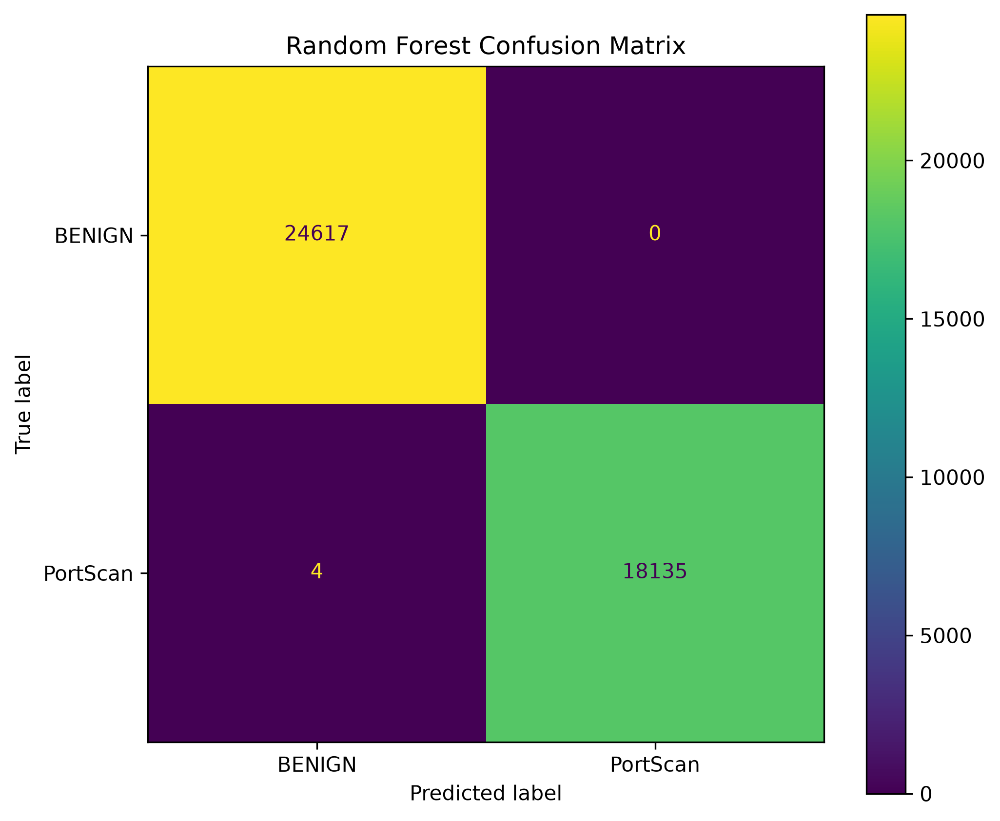
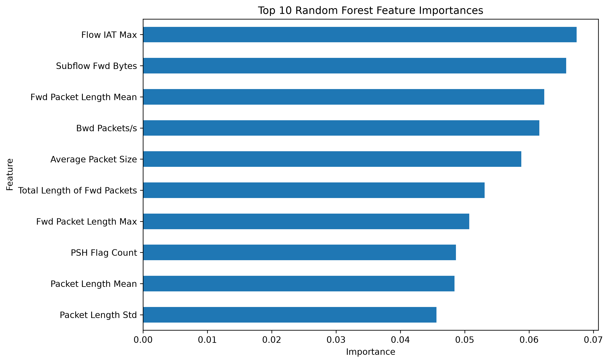

# Network Intrusion Anomaly Detection

A machine learning project for detecting **PortScan attacks** in network traffic using the **CICIDS2017 dataset**.

This project implements an end-to-end machine learning workflow, from data preprocessing and exploratory analysis to model comparison, evaluation, feature importance analysis, and model persistence.

## Project Overview

Network intrusion detection is an important cybersecurity task aimed at identifying malicious activity within network traffic.

This project focuses on distinguishing **BENIGN network traffic** from **PortScan attacks** using supervised machine learning.

The workflow includes:

- Data cleaning and preprocessing
- Exploratory data analysis
- Baseline model development
- Comparison of multiple classification algorithms
- Final Random Forest evaluation
- Confusion matrix analysis
- Feature importance analysis
- Saving the trained model and evaluation results

## Dataset

The project uses the **PortScan subset of the CICIDS2017 dataset**.

After preprocessing, the cleaned dataset contained:

- **213,777** network flows
- **78** predictive features
- **123,083** BENIGN samples
- **90,694** PortScan samples

The raw CICIDS2017 dataset is not included in this repository because of its size.

## Models Evaluated

Three supervised classification models were evaluated:

1. Logistic Regression
2. Decision Tree
3. Random Forest

Among the evaluated models, **Random Forest achieved the strongest overall performance** and was selected as the final model.

## Final Model Performance

| Metric | Score |
|---|---:|
| Accuracy | 0.999906 |
| Precision | 1.000000 |
| Recall | 0.999779 |
| F1-score | 0.999890 |

The final confusion matrix was:

```text
[[24617     0]
 [    4 18135]]
```

Only **four PortScan samples** were incorrectly classified as BENIGN in the held-out test set.

## Confusion Matrix



## Feature Importance

The Random Forest model was also analyzed to identify the features that contributed most strongly to its predictions.

The ten most influential features were:

1. Flow IAT Max
2. Subflow Fwd Bytes
3. Fwd Packet Length Mean
4. Bwd Packets/s
5. Average Packet Size
6. Total Length of Fwd Packets
7. Fwd Packet Length Max
8. PSH Flag Count
9. Packet Length Mean
10. Packet Length Std



## Project Structure

```text
network-intrusion-anomaly-detection/
├── data/
│   └── processed/
│       └── portscan_clean.csv
├── models/
│   └── random_forest_portscan.joblib
├── notebooks/
│   ├── 01_data_exploration.ipynb
│   ├── 02_baseline_model.ipynb
│   ├── 03_model_comparison.ipynb
│   └── 04_final_model_analysis.ipynb
├── results/
│   ├── figures/
│   │   ├── confusion_matrix.png
│   │   └── feature_importance.png
│   ├── classification_report.txt
│   ├── feature_importance.csv
│   └── metrics.csv
├── .gitignore
├── requirements.txt
└── README.md
```

## Technologies

The project was developed using:

- Python
- Pandas
- NumPy
- Scikit-learn
- Matplotlib
- Jupyter Notebook
- Joblib
- Git & GitHub

## Installation

Clone the repository:

```bash
git clone https://github.com/shamim-gharaei/network-intrusion-anomaly-detection.git
```

Move into the project directory:

```bash
cd network-intrusion-anomaly-detection
```

Install the required dependencies:

```bash
pip install -r requirements.txt
```

## Running the Analysis

The analysis is organized into four Jupyter notebooks:

```text
01_data_exploration.ipynb
02_baseline_model.ipynb
03_model_comparison.ipynb
04_final_model_analysis.ipynb
```

They document the workflow from exploratory analysis through final model evaluation.

## Reproducibility

The repository contains:

- Preprocessed PortScan data used in the analysis
- Jupyter notebooks documenting the workflow
- Saved Random Forest model
- Classification report
- Evaluation metrics
- Feature importance results
- Generated evaluation figures
- Python dependency list

These files provide the artifacts used to document and reproduce the reported analysis.

## Limitations

The reported results apply specifically to the evaluated **CICIDS2017 PortScan subset** and the train-test split used in this project.

The high classification performance should therefore not be interpreted as evidence of equivalent performance on unseen networks, different traffic distributions, or other cyberattack categories.

Future evaluation could investigate generalization across different network environments and additional attack types.

## Repository Purpose

This repository demonstrates a complete machine learning workflow for a cybersecurity classification problem, with an emphasis on:

- Reproducible experimentation
- Model comparison
- Evaluation and error analysis
- Feature interpretation
- Organized documentation of results
